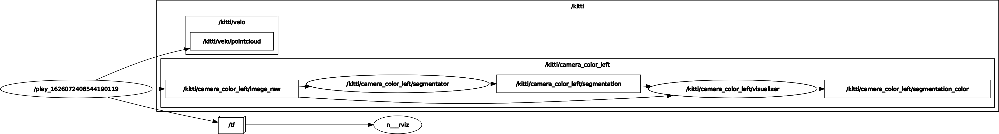

## Подготовка окружения

Выполнение задание предполагает использование операционной системы Ubuntu 20.04.

Перед выполнением задания необходимо установить ROS, следуя [официальной инструкции по установке](http://wiki.ros.org/noetic/Installation/Ubuntu). Для удобства, команды из нее выписаны ниже, но лучше внимательно прочитать оригинал, так как он содержит комментарии.
```bash
sudo sh -c 'echo "deb http://packages.ros.org/ros/ubuntu $(lsb_release -sc) main" > /etc/apt/sources.list.d/ros-latest.list'
sudo apt install curl
curl -s https://raw.githubusercontent.com/ros/rosdistro/master/ros.asc | sudo apt-key add -
sudo apt update
sudo apt install ros-noetic-desktop-full
sudo apt install python3-rosdep python3-rosinstall python3-rosinstall-generator python3-wstool build-essential
sudo rosdep init
rosdep update
```

Для знакомства с ROS рекомендуется ознакомиться с [официальными туториалами](http://wiki.ros.org/ROS/Tutorials)

Далее необходимо размесить исходный код этого репозитория в папке src внутри директории рабочего пространства, которую обычно называют catkin_ws:
```bash
$ mkdir ~/catkin_ws/src -p && cd ~/catkin_ws/src
$ git clone https://github.com/cds-mipt/raai_summer_school_cv_2021.git
```

Также необходимо установить [miniconda]() и создать окружение. В зависимости от наличия GPU NVidia нужно выбрать соответствующий environment файл:
```bash
conda env create -f environment_cuda.yml
# или
conda env create -f environment_cpu.yml
```

## Базовые операции с моделями в PyTorch

Примеры использования базовых моделей классификации и семантической сегментации, сохренения/загрузки весов, визуализации их архитектуры, пошаговой подготовки данных можно найти в [jupyter тетрадке](notebooks/model_inference.ipynb)

## Использование моделей глубокого обучения в ROS узлах

Пример реализации модуля семантической сегментации и модуля визуализации приведен в директории [segmentator](segmentator)

После сборки рабочего пространства запуск узлов на kitti можно выполнить с помощью команды:
```bash
$ conda activete <имя окружения>
$ source devel/setup.bash
$ roslaunch segmentator main.launch \
      camera_ns:=/kitti/camera_color_left \
      image_topic:=image_raw \
      colorize:=true \
      rviz:=true
```

[launch](http://wiki.ros.org/roslaunch/XML) файл [main.launch](segmentator/launch/main.launch) содержит инструкции по запуску набора узлов - [segmentator.py](segmentator/scripts/segmentator.py), выполняющего семантическую сегментацию, и [visualizer.py](segmentator/scripts/visualizer.py) - визуализирующего результат работы segmentator.py.



Для того, чтобы иметь доступ к ROS из conda окружения, в него необходимо установить пакет [rospkg](https://anaconda.org/conda-forge/rospkg):
```bash
$ conda install -c conda-forge rospkg
```