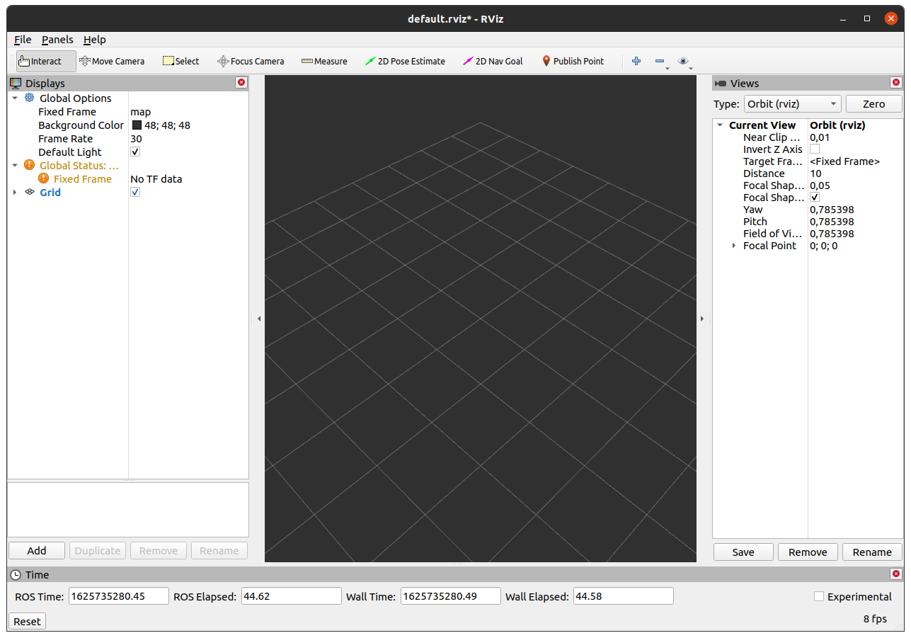
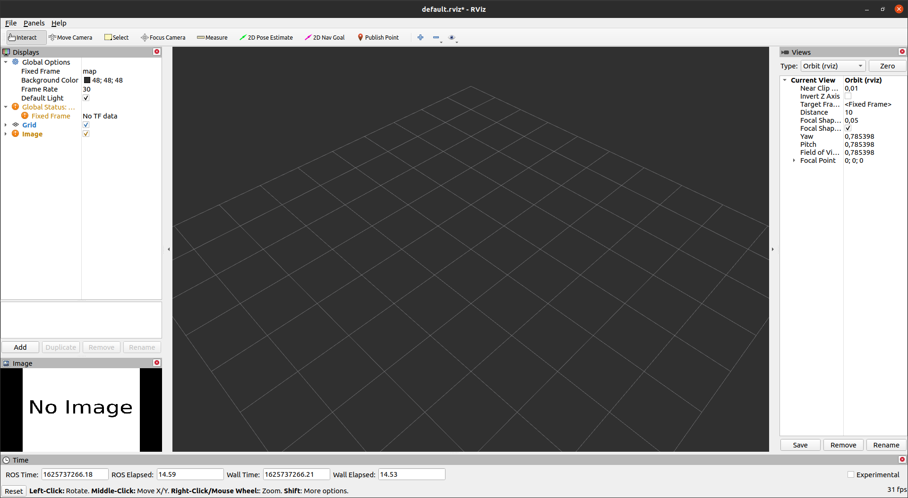
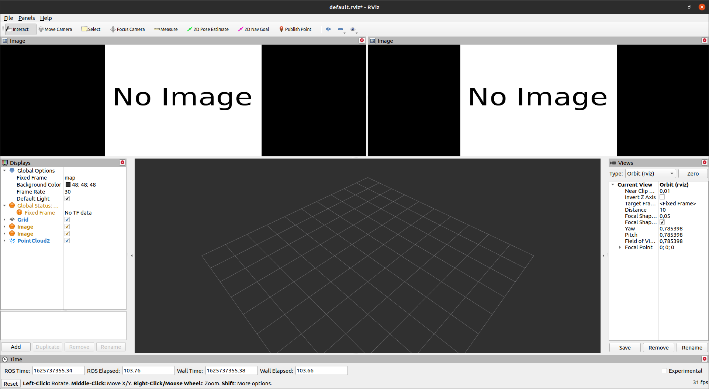
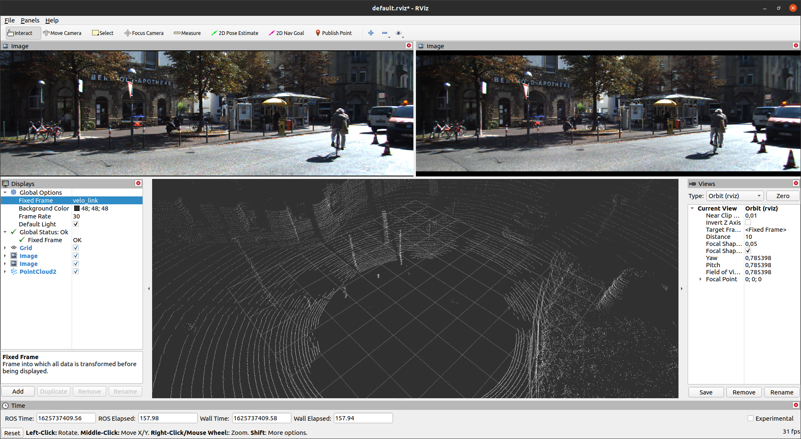
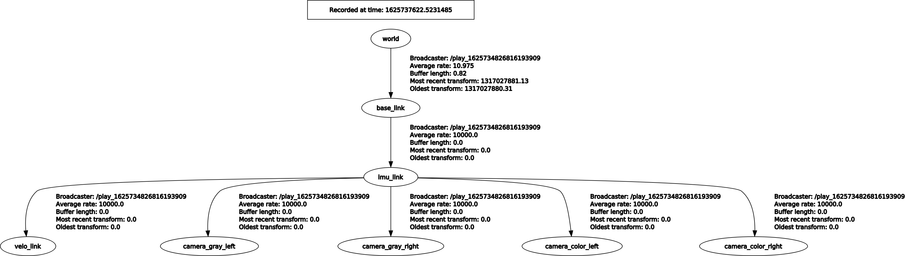

## Подготовка окружения

Выполнение задание предполагает использование операционной системы Ubuntu 20.04.

Перед выполнением задания необходимо установить ROS, следуя [официальной инструкции по установке](http://wiki.ros.org/noetic/Installation/Ubuntu). Для удобства, команды из нее выписаны ниже, но лучше внимательно прочитать оригинал, так как он содержит комментарии.
```bash
sudo sh -c 'echo "deb http://packages.ros.org/ros/ubuntu $(lsb_release -sc) main" > /etc/apt/sources.list.d/ros-latest.list'
sudo apt install curl
curl -s https://raw.githubusercontent.com/ros/rosdistro/master/ros.asc | sudo apt-key add -
sudo apt update
sudo apt install ros-noetic-desktop-full
sudo apt install python3-rosdep python3-rosinstall python3-rosinstall-generator python3-wstool build-essential
sudo rosdep init
rosdep update
```

Для знакомства с ROS рекомендуется ознакомиться с [официальными туториалами](http://wiki.ros.org/ROS/Tutorials)

Далее необходимо размесить исходный код этого репозитория в папке src внутри директории рабочего пространства, которую обычно называют catkin_ws:
```bash
$ mkdir ~/catkin_ws/src -p && cd ~/catkin_ws/src
$ git clone https://github.com/cds-mipt/raai_summer_school_cv_2021.git
```

## Загрузка и подготовка данных

Переходим на сайт с "сырыми" данными KITTI - http://www.cvlibs.net/datasets/kitti/raw_data.php?type=city. Выбираем там последовательность и скачиваем её себе на рабочую станцию. Скачать нужно [synced+rectified data], [calibration] и [tracklets]. Переходим в директорию с загруженными данными и открываем терминал.

Допустим скачали последовательность 2011_09_26_drive_0005. Распаковываем архивы:
```bash
$ unzip 2011_09_26_drive_0005_sync.zip
$ unzip 2011_09_26_calib.zip
$ unzip 2011_09_26_drive_0005_tracklets.zip
```

Далее создаем из данных единый BAG файл с помощью инструмента [kitti2bag](https://github.com/tomas789/kitti2bag). Сначала его необходимо установить:
```bash
$ sudo apt install python3-pip
$ python3 -m pip install --user kitti2bag
$ kitti2bag -t 2011_09_26 -r 0005 raw_synced
```
После успешной установки запуск процесса конвертации осуществляется следующей командой:
```bash
$ source /opt/ros/noetic/setup.bash
$ kitti2bag -t 2011_09_26 -r 0005 raw_synced
```
Обратите внимание на первую команду: она производит "активацию" ROS окружения. Эта "активация" заключается в установке особых переменных среды, начинающихся с префикса ROS_. Посмотреть значения этих переменных можно с помощью команды:
```bash
$ printenv | grep ROS
```
Пример вывода:
```bash
ROS_VERSION=1
ROS_PYTHON_VERSION=3
ROS_PACKAGE_PATH=/opt/ros/noetic/share
ROS_ETC_DIR=/opt/ros/noetic/etc/ros
ROS_MASTER_URI=http://localhost:11311
ROS_ROOT=/opt/ros/noetic/share/ros
ROS_DISTRO=noetic
```
Кроме того модифицируются некоторые другие переменные, которые делают возможным использование консольных команд вида ros*, а также доступ к ROS пакетам из python. Эту команду необходимо выполнять каждый раз при открытии новой консоли, если в ней предполагается работа с ROS, в том числе запуск python скриптов, jupyter тетрадок, в которых будет производиться обращение к ROS пакетам.

В результате конвертации будет создан файл `kitti_2011_09_26_drive_0005_synced.bag`. Посмотреть его содержимое можно с помощью команды:
```bash
$ rosbag info kitti_2011_09_26_drive_0005_synced.bag
path:        kitti_2011_09_26_drive_0005_synced.bag
version:     2.0
duration:    15.8s
start:       Sep 26 2011 13:04:32.35 (1317027872.35)
end:         Sep 26 2011 13:04:48.13 (1317027888.13)
size:        834.1 MB
messages:    2156
compression: none [616/616 chunks]
types:       geometry_msgs/TwistStamped [98d34b0043a2093cf9d9345ab6eef12e]
             sensor_msgs/CameraInfo     [c9a58c1b0b154e0e6da7578cb991d214]
             sensor_msgs/Image          [060021388200f6f0f447d0fcd9c64743]
             sensor_msgs/Imu            [6a62c6daae103f4ff57a132d6f95cec2]
             sensor_msgs/NavSatFix      [2d3a8cd499b9b4a0249fb98fd05cfa48]
             sensor_msgs/PointCloud2    [1158d486dd51d683ce2f1be655c3c181]
             tf2_msgs/TFMessage         [94810edda583a504dfda3829e70d7eec]
topics:      /kitti/camera_color_left/camera_info    154 msgs    : sensor_msgs/CameraInfo    
             /kitti/camera_color_left/image_raw      154 msgs    : sensor_msgs/Image         
             /kitti/camera_color_right/camera_info   154 msgs    : sensor_msgs/CameraInfo    
             /kitti/camera_color_right/image_raw     154 msgs    : sensor_msgs/Image         
             /kitti/camera_gray_left/camera_info     154 msgs    : sensor_msgs/CameraInfo    
             /kitti/camera_gray_left/image_raw       154 msgs    : sensor_msgs/Image         
             /kitti/camera_gray_right/camera_info    154 msgs    : sensor_msgs/CameraInfo    
             /kitti/camera_gray_right/image_raw      154 msgs    : sensor_msgs/Image         
             /kitti/oxts/gps/fix                     154 msgs    : sensor_msgs/NavSatFix     
             /kitti/oxts/gps/vel                     154 msgs    : geometry_msgs/TwistStamped
             /kitti/oxts/imu                         154 msgs    : sensor_msgs/Imu           
             /kitti/velo/pointcloud                  154 msgs    : sensor_msgs/PointCloud2   
             /tf                                     154 msgs    : tf2_msgs/TFMessage        
             /tf_static                              154 msgs    : tf2_msgs/TFMessage
```
Полный список доступных опций можно получить с помощью команды:
```bash
$ rosbag -h
Usage: rosbag <subcommand> [options] [args]

A bag is a file format in ROS for storing ROS message data. The rosbag command can record, replay and manipulate bags.

Available subcommands:
   check  	Determine whether a bag is playable in the current system, or if it can be migrated.
   compress  	Compress one or more bag files.
   decompress  	Decompress one or more bag files.
   decrypt  	Decrypt one or more bag files.
   encrypt  	Encrypt one or more bag files.
   filter  	Filter the contents of the bag.
   fix  	Repair the messages in a bag file so that it can be played in the current system.
   help  
   info  	Summarize the contents of one or more bag files.
   play  	Play back the contents of one or more bag files in a time-synchronized fashion.
   record  	Record a bag file with the contents of specified topics.
   reindex  	Reindexes one or more bag files.

For additional information, see http://wiki.ros.org/rosbag
```
Более подробное описание каждой команды можно получить выполнив в консоли:
```bash
$ rosbag info -h
Usage: rosbag info [options] BAGFILE1 [BAGFILE2 BAGFILE3 ...]

Summarize the contents of one or more bag files.

Options:
  -h, --help         show this help message and exit
  -y, --yaml         print information in YAML format
  -k KEY, --key=KEY  print information on the given key
  --freq             display topic message frequency statistics
```

## Воспроизведение BAG файла

Перед воспроизведением данных необходимо запустить ядро ROS (core, master). Сделать это нужно в отдельной консоли и оставить работать на все время взаимодействия с ROS.
```bash
$ source /opt/ros/noetic/setup.bash
$ roscore
```
`roscore` - это отдельны процесс который отвечает за взаимодействие других узлов сети. Ядро (как правило, называют master, так как раньше был `rosmaster`) знает все об узлах сети, и если один узел хочет начать взаимоействие с другим узлом, то сначала происходит обращение к master, который отвечает, как установить соединение между узлами. Кроме того, он отвечает за часы. По-умолчанию ROS-время совпадает с временем системных часов. При обработке данных в режиме реального времени с физических сенсоров так и должно быть. Но если предполарается работать с данными, записанными ранее, то необходимо запретить использование системных часов, установив параметр `use_sim_time`:
```bash
$ rosparam set use_sim_time true
```

Запустить воспроизведение полученного BAG файла можно с помощью команды:
```bash
$ rosbag play kitti_2011_09_26_drive_0005_synced.bag --clock
```
Параметр `--clock` разрешает публикацию времени BAG файла. По умолчанию, из BAG файла публикуются все сообщения всех топиков в реальном времени. Ограничить набор топиков можно с помощью параметра `--topics`, изменить скорость воспроизведения с помощью парметра `-r`. Также полезным является параметр `--pause` который не позволяет начать воспроизведение до нажатия `Space`.

После начала воспроизведения BAG файла в системе появятся топики, список которых можно отобразить с помощью команды:
```bash
$ rostopic list
/clock
/kitti/camera_color_left/camera_info
/kitti/camera_color_left/image_raw
/kitti/camera_color_right/camera_info
/kitti/camera_color_right/image_raw
/kitti/camera_gray_left/camera_info
/kitti/camera_gray_left/image_raw
/kitti/camera_gray_right/camera_info
/kitti/camera_gray_right/image_raw
/kitti/oxts/gps/fix
/kitti/oxts/gps/vel
/kitti/oxts/imu
/kitti/velo/pointcloud
/rosout
/rosout_agg
/tf
/tf_static
```

Просмотр информации о конкретном топике:
```bash
$ rostopic info /kitti/camera_color_left/image_raw
Type: sensor_msgs/Image

Publishers: 
 * /play_1625734826816193909 (http://ivb-ThinkPad-L380:41451/)

Subscribers: None
```

Для визуализации данных можно воспользоваться инструментом RViz:
```bash
$ rviz
```

По-умолчанию в нем не будет ничего отображаться, его нужно настроить, добавив нужные топики. Для этого нужно выбрать: `Add->By topic`, выбрать нужный топик и нажать `OK`. Например, после выбора топика `/kitti/camera_color_left/image_raw:Image` окно будет выглядеть так:

Добавим дополнительно топики: `/kitti/camera_color_right/image_raw:Image`, `/kitti/velo/pointcloud`, после чего реорганизуем окна, как показано на рисунке:

Чтобы при каждом открытии `RViz` не настраивать всё вручную, можно сохранить/загрузить файл конфигурайии через меню `File`.
После запуска BAG файла отобразятся изображения с левой и правой камер, но данных лидара не будет. При этом в окне слева будут две ошибки:
1. Global Status: Error -> Fixed Frame : Unknown frame map
2. PointCloud2 -> Status:Error -> Transform : For frame [velo_link]: Fixed Frame [map] does not exist

Причины этого в следующем. Данные лидара являются трехмерным облаком точек и будут отображаться в окне посередине. При этом, эти данные получены в системе отсчета, связанной с лидаром. Каждая система отсчета имеет свое имя, которое может быть произвольным. Это имя содержится в сообщениях с данными в поле header.frame_id. Например если в консоли во время проигрывания BAG файла выполнить:
```bash
$ rostopic echo /kitti/velo/pointcloud/header/frame_id
"velo_link"
---
```
То можно увидеть название системы отсчета лидара - `velo_link`. При этом с визуализатором трехмерных данных связана система отсчета, указанная в левом окне в поле Global Options -> Fixed Frame : map. То есть имеет название map. Устранить ошибку можно задав в этом поле значение, совпадающее с названием системы отсчета сенсора - `velo_link`. После этого, ошибка исчезнет, а в центральном окне отобразятся облака точек:


Отобразить существующие системы отсчета и переходы между ними можно с помощью плагина TF Tree инструмента визуализации
rqt:
```bash
$ rqt
```

Все эти переходы записаны в BAG файл в топики /tf и /tf_static. Если теперь в качестве Fixed Frame указать world, то можно наблюдать за движением автомобиля. Визуализировать TF Tree можно и в RViz, для этого необходимо выполнить: Add -> By display type -> TF -> Ok.

## Работа с BAG файлом в python

См. [ноутбук](notebooks/bag_file_in_python.ipynb)

## Publisher - Subscriber in python

Реализация python скрипта, который будет взаимодействовать с инфраструктурой ROS системы, начинается с создания ROS пакета с помощью команды:
```bash
$ cd ~/catkin_ws/src/raai_summer_school_cv_2021/ros_basics
$ catkin_create_pkg my_cool_packet rospy std_msgs sensor_msgs
```
При этом будет создана папка my_cool_packet, в файле package.xml будут прописаны зависимости - rospy std_msgs sensor_msgs, имя пакета, его версия, контакты для связи с разработчиком и т.д., файл CMakeLists.txt нужет для C++ пакетов. Во вложенной директории предполагается хранение исходного кода. Для python кода обычно используют папку scripts, поэтому переименуем её и перенесем в неё содержимое директории [scripts](scripts) данного репозитория.

Далее необходимо собрать рабочее пространство
```bash
$ cd ~/catkin_ws
$ catkin_make
```
Эта команда находит все ROS пакеты используя файл package.xml, исполняемые python скрипты в них могут быть запущены в качестве узлов. То есть, при создании собственного python скрипта его необходимо пометить как исполняемый, чтобы они были корректно распознаны:
```bash
$ chmod +x my_script.py
```
Также стоит обратить внимание на наличие строки `#!/usr/bin/python3` в начале скрипта.
После сборки можно запустить узел crop_image.py
```bash
rosrun my_cool_packet crop_image.py image:=/kitti/camera_color_left/image_raw _x_bottom_right:=200 _y_bottom_right:=200
```
